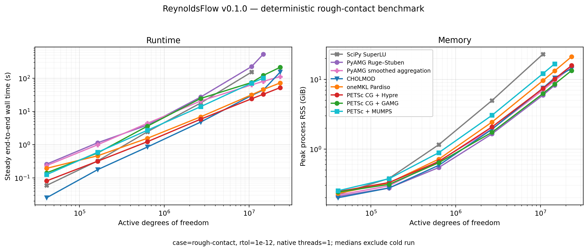

# ReynoldsFlow 0.1.0 numerical and performance report

Date: 2026-07-12

This report defines the reproducible release baseline. Historical benchmark
tables and figures remain in the repository for provenance but are not used to
assess version 0.1.0.

## Benchmark environment

- 13th Gen Intel Core i7-13700H, 14 physical cores / 20 logical CPUs, 32 GiB
  RAM, Linux 6.8 x86-64.
- Python 3.12.13, NumPy 2.4.2, SciPy 1.17.1, Numba 0.64.0,
  scikit-image 0.26.0, and PyAMG 5.3.0.
- Netlib BLAS/LAPACK 3.11.0 for SciPy, CHOLMOD, PETSc, and MUMPS.
- pypardiso 0.4.7 with Intel oneMKL 2025.3.
- scikit-sparse 0.4.16 with SuiteSparse 7.10.1.
- petsc4py 3.24.4, PETSc 3.24.5, OpenMPI 5.0.10, Hypre 3.1.0, and
  MUMPS 5.8.2; one MPI rank.
- `OMP_NUM_THREADS=MKL_NUM_THREADS=OPENBLAS_NUM_THREADS=1`.

## Method

The deterministic Cartesian `rough-contact` case was run at `256²`, `512²`,
`1024²`, `2048²`, `4096²`, `5120²`, and `6144²` with seed 23349, compact
active-DOF assembly, and `rtol=1e-12`. All eight backends were tested through
`4096²`. SuperLU was excluded from larger attempts after consuming 23.10 GiB
at `4096²`; the other seven were run at `5120²` and attempted at `6144²`.
Every backend ran in a separate subprocess. Each successful process made one
cold run followed by two steady runs.

Reported runtime is the median steady end-to-end wall time: connectivity,
assembly, sparse-format conversion, solver setup/factorization, linear solve,
face flux, cell flux, and boundary integration. Case generation is excluded.
Peak RSS is the process high-water mark and includes imports, native/JIT state,
input/output arrays, sparse matrices, preconditioners or factors, and all
completed stages.



The exact plotted data are stored in
[`benchmarks/results/rough-contact-scaling-v0.1.0.csv`](../benchmarks/results/rough-contact-scaling-v0.1.0.csv).

Successful curves terminate at the last measured point. Failed attempts are
reported below but are not converted into timing or memory points.

## Largest successful case

The `6144²` case retained 23,301,121 active DOFs (61.7% of the grid) and
116,378,457 matrix nonzeros. Five backends completed the full three-run
protocol.

| Solver | Steady total (s) | Linear stage (s) | Peak RSS (GiB) | Iterations |
|---|---:|---:|---:|---:|
| `petsc-cg.hypre` | 52.18 | 48.70 | 15.85 | 16 |
| `pardiso` | 72.40 | 68.93 | 21.22 | direct |
| `scipy.amg-smooth_aggregation` | 111.90 | 108.42 | 15.05 | 26 |
| `cholesky` | 153.52 | 150.02 | 14.36 | direct |
| `petsc-cg.gamg` | 214.16 | 210.78 | 13.40 | 156 |

All successful backends passed the true algebraic residual check. On the
largest case, the maximum true relative residual was `9.16e-13` and the
maximum boundary-flux conservation error was `1.25e-9`. Across every
successful point in the seven-size sweep, the corresponding maxima were
`9.16e-13` and `7.72e-8`.

## Solver capacity on the 32 GiB host

| Solver | Largest success | Active DOFs | Steady total (s) | Peak RSS (GiB) | Next attempted limit |
|---|---:|---:|---:|---:|---|
| `scipy-spsolve` | `4096²` | 10,722,930 | 153.50 | 23.10 | `5120²` not attempted; approximately 38 GiB projected |
| `scipy.amg-rs` | `5120²` | 14,725,073 | 531.47 | 8.26 | `6144²` exceeded 5400 s process timeout |
| `scipy.amg-smooth_aggregation` | `6144²` | 23,301,121 | 111.90 | 15.05 | completed |
| `cholesky` | `6144²` | 23,301,121 | 153.52 | 14.36 | completed |
| `pardiso` | `6144²` | 23,301,121 | 72.40 | 21.22 | completed |
| `petsc-cg.hypre` | `6144²` | 23,301,121 | 52.18 | 15.85 | completed |
| `petsc-cg.gamg` | `6144²` | 23,301,121 | 214.16 | 13.40 | completed |
| `petsc-mumps` | `5120²` | 14,725,073 | 101.26 | 16.77 | `6144²` exited with `SIGKILL` after 203 s |

The MUMPS worker produced no result at `6144²`. Its `SIGKILL` under the
highest factor-memory workload is consistent with an operating-system memory
termination, but no successful worker RSS was available to record. The
Ruge–Stuben worker was terminated by the suite's explicit timeout. These are
resource-capacity outcomes, not failed residual checks.

These results are specific to this matrix family and binary environment.
Direct solvers remain competitive where their factors fit, but fill sets a
hard capacity limit. Hypre is the strongest large-case configuration on this
host. Smoothed aggregation is the practical portable PyAMG choice at these
sizes; classical Ruge–Stuben remained memory-efficient but became
runtime-limited.

## Correctness changes relative to the pre-0.1 code

| Regression case | Previous behavior | Version 0.1.0 |
|---|---:|---:|
| Cartesian unit gap, `24 x 24`, expected `Q=1` | `Q=1.92` | `Q=1.0000000000000018` |
| Cartesian unit-gap conservation | approximately `4e-11` in an iterative smoke test | `2.89e-15` with direct reference |
| Polar unit gap, `16 x 32`, boundary conservation error | `4.96e-2` | `1.82e-14` |
| Polar `24 x 48`, analytical total-flow relative error | inconsistent postprocessing | `8.5e-5` |

The Cartesian and polar stored operators are symmetric after boundary
elimination and polar row scaling. Flux reconstruction uses the same harmonic
face conductances as matrix assembly.

Compact active-DOF and full-grid reference systems agree on active-cell
pressure to approximately `3e-13` in deterministic regression tests. The
compact system has exactly one unknown per retained positive spanning cell.

## Tolerance calibration

On the compact `512²` rough case, the direct reference produced
`Q=0.002964149471992414`.

| Iterative tolerance | Total flow | Relative flow error | Conservation error |
|---:|---:|---:|---:|
| `1e-10` | `0.002964152415423008` | approximately `9.9e-7` | `1.98e-6` |
| `1e-12` | `0.002964149475495322` | approximately `1.2e-9` | `1.61e-9` |

This sensitivity motivates the version 0.1.0 default `rtol=1e-12`.

## Reproduction

```bash
for n in 256 512 1024 2048 4096; do
  python -m benchmarks.benchmark_suite \
    --case rough-contact --size "$n" --rtol 1e-12 \
    --repeat 3 --threads 1 \
    --output "benchmarks/results/rough-contact-${n}.json"
done

python -m benchmarks.benchmark_suite \
  --case rough-contact --size 5120 --rtol 1e-12 \
  --repeat 3 --threads 1 --timeout 3600 \
  --solvers cholesky pardiso petsc-mumps petsc-cg.hypre petsc-cg.gamg \
    scipy.amg-smooth_aggregation scipy.amg-rs \
  --output benchmarks/results/rough-contact-5120.json

python -m benchmarks.benchmark_suite \
  --case rough-contact --size 6144 --rtol 1e-12 \
  --repeat 3 --threads 1 --timeout 5400 \
  --solvers petsc-mumps pardiso cholesky petsc-cg.hypre petsc-cg.gamg \
    scipy.amg-smooth_aggregation scipy.amg-rs \
  --output benchmarks/results/rough-contact-6144.json

python -m benchmarks.plot_solver_scaling \
  benchmarks/results/rough-contact-{256,512,1024,2048,4096,5120,6144}.json \
  --output docs/img/rough_contact_solver_scaling_v0.1.0.png \
  --csv-output benchmarks/results/rough-contact-scaling-v0.1.0.csv
```

Raw subprocess reports are ignored because they contain bulky repeated data;
the compact CSV and generated figure are versioned release artifacts.
